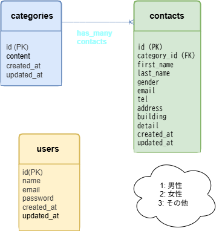

# contact-form-check-test

## 概要　
このリポジトリは、確認テスト第1回の課題として作成したお問い合わせフォームです。  
LaravelとDockerを使用して、ローカル環境で動作するフォーム機能を構築しています。

---

## 🛠️ 環境構築手順

### 1. リポジトリの設定
このプロジェクトのベースとなるコードを取得するために、GitHubからリポジトリをクローンします。

### 2. Docker の設定
ローカル環境に必要なサービス（PHP, MySQLなど）をDockerで構築・起動します。

以下のコマンドでDocker環境を構築・起動しました：
```bash
docker-compose up -d --build
```

### 3. Laravel のパッケージのインストール
Laravelの動作に必要な依存パッケージをインストールします。
```bash
docker-compose exec app bash
composer install
```

### 4. .env ファイルの作成
Laravelの環境設定を行うために、.envファイルを作成し、アプリケーションキーを生成します。
```bash
cp .env.example .env
php artisan key:generate
```

### 5. View ファイルの作成
ユーザーが入力するお問い合わせフォーム画面や関連画面を作成しました。  
主なファイル:
- `resources/views/inquiry/form.blade.php` （お問い合わせフォーム）
- `resources/views/inquiry/confirm.blade.php` （確認画面）
- `resources/views/inquiry/thanks.blade.php` （送信完了画面）
- `resources/views/layouts/partials/header.blade.php` / `footer.blade.php` （共通レイアウト）
- `resources/views/auth/login.blade.php` / `register.blade.php` （認証関連）

### 6. CSS ファイルの作成
フォームや各画面のデザインを整えるためのスタイルを作成しました。  
主なファイル:
- `public/css/form.css` （お問い合わせフォーム用）
- `public/css/confirm.css` （確認画面用）
- `public/css/thanks.css` （完了画面用）
- `public/css/login.css` / `register.css` （認証画面用）
- `public/css/admin.css` （管理画面用）
- `public/css/sanitize.css` （リセット用）
- `public/css/style.css` （共通スタイル）

## 🛠 使用技術（この例で使われている環境）
- PHP 8.0
- Laravel 10.0
- MySQL 8.0
- Docker (nginx, php, mysql, phpmyadmin)

## 🗂 ER図（このプロジェクトのデータ構造）
このアプリケーションのデータ構造を視覚的に把握するため、以下にER図を掲載しています。

この図では、`contacts` テーブルが `categories` テーブルに属する「1対多」の関係を示しています。  
各テーブルは右形式（表形式）で構成されており、主キー（PK）・外部キー（FK）の役割が明示されています。  
また、`gender` カラムは仕様書に従い **tinyint 型（1: 男性、2: 女性）** として保存されます。



※ 補足：
- 図は draw.io にて作成し、PNG形式で保存しています。
- 元データは `src/contact-form-er-v2.drawio` にて編集可能です。
- 編集には [draw.io（diagrams.net）](https://app.diagrams.net/) を使用してください。  
　ローカルアプリまたはブラウザ版のどちらでも編集可能です。

### データ仕様（要点）

- contacts.gender: tinyint 型（1=男性, 2=女性）
- Factory では gender を数値で生成（randomElement([1, 2])）

### ダミーデータの作成

- contacts テーブル: Factory を使用して 35 件のダミーデータを作成
  - gender は仕様書に従い **1=男性, 2=女性** のいずれかをランダムに生成
- categories テーブル: Seeder を使用して以下 4 件を作成
  1. 商品のお届けについて
  2. 商品の交換について
  3. 商品トラブル
  4. ショップへのお問い合わせ
 
## 🌐 ローカル環境での確認用URL
- アプリケーション: [http://localhost/](http://localhost/)
- phpMyAdmin: [http://localhost:8080/](http://localhost:8080/)

## 実装状況
- [x] Docker 環境構築 (nginx, php, mysql, phpmyadmin)
- [x] Laravel プロジェクト作成
- [x] Blade によるフォーム作成
- [x] バリデーション実装
- [ ] Seeder 実行時のエラー解消（未完了）

## 既知の問題
- `php artisan migrate:fresh --seed` 実行時に **migrations テーブル作成でエラー**が発生  
- データベース自体は `utf8mb4` 設定済みだが、テーブル作成時にエンジン・照合順序でエラーが出る  
- 時間の都合で完全解決には至らず、現状のまま提出  

## 提出にあたって
- main ブランチにコミット済み  
- `.env` や `vendor/` ディレクトリはセキュリティ・再現性の観点からコミットしていません  

## 動作確認
- アプリケーション: http://localhost/  
- phpMyAdmin: http://localhost:8080/  

## ライセンス
このリポジトリは学習・確認テスト用に作成したものであり、商用利用は想定していません。
